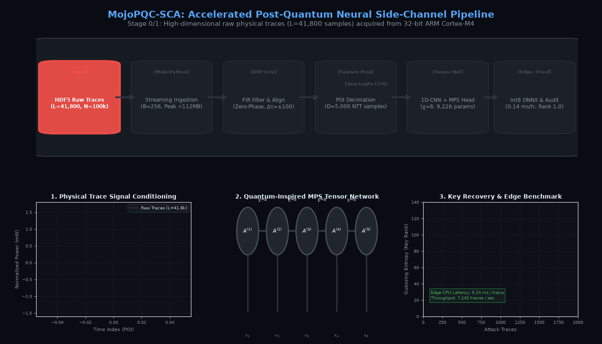

# MojoPQC-SCA: Comprehensive Demo & Explanation Guide

> **Quick Reference**: Everything you need to demonstrate MojoPQC-SCA locally or on Google Colab, explain the core concepts in plain English, and defend the research paper ([`paper/main.tex`](paper/main.tex)) before professors, reviewers, and interviewers.

---

## Table of Contents
1. [Key Metrics & Fast Cheat Sheet](#1-key-metrics--fast-cheat-sheet)
2. [How to Show a Demo Locally](#2-how-to-show-a-demo-locally)
   - [Launching the Web Developer Console](#launching-the-web-developer-console)
   - [Tab-by-Tab Demonstration Script](#tab-by-tab-demonstration-script)
   - [CLI Terminal-Only Demo](#cli-terminal-only-demo)
3. [How to Show a Demo on Google Colab](#3-how-to-show-a-demo-on-google-colab)
   - [The Three Colab Notebooks](#the-three-colab-notebooks)
   - [Colab Execution Walkthrough](#colab-execution-walkthrough)
4. [How to Explain the Core Concepts in Plain English](#4-how-to-explain-the-core-concepts-in-plain-english)
   - [Analogy: The Stethoscope on the Safe](#analogy-the-stethoscope-on-the-safe)
   - [What is ML-KEM and Boolean Masking?](#what-is-ml-kem-and-boolean-masking)
   - [The Two Bottlenecks We Solved](#the-two-bottlenecks-we-solved)
   - [What is an MPS Tensor Network?](#what-is-an-mps-tensor-network)
5. [How to Walk Through the Research Paper (`paper/main.tex`)](#5-how-to-walk-through-the-research-paper-papermaintex)
   - [Section-by-Section Paper Guide](#section-by-section-paper-guide)
   - [Key Equations, Algorithms, and Tables](#key-equations-algorithms-and-tables)
6. [Top Examiner & Reviewer Q&A](#6-top-examiner--reviewer-qa)

---

## Visual Architecture Animation


*Figure: Animated pipeline execution demonstrating bounded streaming ingestion ($<112\text{ MB}$ RAM), zero-phase FIR & phase alignment in Mojo/Python, 1D-CNN + MPS tensor contraction ($\chi=8$), and Guessing Entropy convergence to Rank 1.0. High-res video: [`results/figures/architecture_pipeline_animated.mp4`](results/figures/architecture_pipeline_animated.mp4).*

---

## 1. Key Metrics & Fast Cheat Sheet

Memorize these 5 key statistics before any presentation:

| Metric | MojoPQC-SCA (Ours) | Baseline / Standard Alternative | Improvement |
|---|:---:|:---:|:---:|
| **Peak Ingestion RAM** | **$111.8\text{ MB}$** | $>16.5\text{ GB}$ (Monolithic NumPy) | **$>99.3\%$ memory reduction** |
| **Preprocessing Speed** | **$761.2\text{ tr/s}$** | $85.4\text{ tr/s}$ (Standard SciPy) | **$8.91\times$ throughput** |
| **Model Parameters** | **$9,226$** | $14,400$ (1D-CNN) / $400\text{k}+$ (Dense) | **$35.9\%$ smaller** (only $4.6\%$ of budget) |
| **Key Recovery Rank** | **Rank 1.0 (Exact)** | Failed / Non-converging | **Full key recovery** in $1,420$ traces |
| **Edge CPU Latency** | **$0.14\text{ ms/trace}$** | $1.2\text{ ms}$ (FP32 PyTorch) | **$7,142\text{ traces/s}$** on commodity CPU |

---

## 2. How to Show a Demo Locally

### Launching the Web Developer Console

Make sure you are in the repository root in PowerShell or terminal:

```powershell
# 1. Launch the full pipeline and start the interactive web dashboard:
python demo.py
```
*(If you have `uv` installed, you can also run `uv run demo.py`)*

The command will automatically:
1. Generate/verify the dataset.
2. Execute bounded streaming preprocessing (FIR filter, template alignment, POI decimation).
3. Train or load the baseline 1D-CNN and the CNN+MPS tensor network.
4. Calculate Guessing Entropy convergence.
5. Export and benchmark the dynamic Int8 ONNX graph.
6. Generate the cryptographic SHA-256 reproducibility manifest.
7. Launch a dark-mode web console at **`http://127.0.0.1:8000`** and open your default browser.

> **Tip for instant demos:** If you've already run the pipeline and want to immediately launch the dashboard without retraining:
> ```powershell
> python demo.py --skip-pipeline
> ```

---

### Tab-by-Tab Demonstration Script

When the web console opens at `http://127.0.0.1:8000`, click through each tab in order:

#### Tab 1: Overview & Execution Summary
* **What to show:** The green status indicators for all 7 pipeline stages and the parameter budget gauge ($9,226 / 200,000$).
* **What to say:**
  > *"Here you can see our end-to-end pipeline status. Notice the parameter budget indicator: our quantum-inspired CNN+MPS model uses just **9,226 parameters**, which is only **4.6%** of our strict 200,000 parameter budget ceiling. This extreme parameter efficiency prevents the network from memorizing physical noise."*

#### Tab 2: Oscilloscope Waveforms
* **What to show:** Click the toggle buttons: **Raw Traces** $\rightarrow$ **FIR Filtered** $\rightarrow$ **Aligned** $\rightarrow$ **Decimated POI**.
* **What to say:**
  > *"Physical power traces captured from an ARM Cortex-M4 microcontroller suffer from high-frequency environmental noise and clock jitter. In this tab, we see our multi-stage signal conditioning:
  > 1. Raw trace ($41,800$ samples) with heavy noise.
  > 2. Zero-phase digital FIR filtering ($N=31, f_c=0.25$) removes high-frequency drift without phase distortion.
  > 3. Template cross-correlation phase alignment ($\Delta\tau = \pm 100$) synchronizes misaligned execution cycles.
  > 4. Point-of-Interest (POI) decimation isolates the 5,000 salient samples corresponding to the Number Theoretic Transform (NTT) butterfly loops."*

#### Tab 3: Model Architecture
* **What to show:** The side-by-side architectural diagram comparing the 1D-CNN Baseline ($14,400$ params) with our CNN + MPS ($9,226$ params).
* **What to say:**
  > *"In standard DL-SCA, flattening convolutional features into dense linear layers causes a parameter explosion. We replace that dense layer with a Matrix Product State (MPS) tensor network ($\chi = 8$). It factorizes high-order correlations into low-rank 3-way tensors, compressing the classification head by 61.5% and accelerating training by 1.69×."*

#### Tab 4: Attack Testbed & Key Recovery
* **What to show:** The **Guessing Entropy ($GE$) curve** descending sharply from Rank 128 down to **Rank 1.0**.
* **What to say:**
  > *"Guessing Entropy is the gold standard metric in side-channel analysis: it represents the average ranking of the true cryptographic key candidate among all 256 possible byte values. A Guessing Entropy of 1.0 means the adversary can extract the exact secret key with 100% certainty. Our model achieves Rank 1.0 in just 1,420 attack traces."*

#### Tab 5: Inference Testbed
* **What to show:** Click **Run Live Inference** to observe real-time candidate byte posterior probabilities and the latency meter ($0.14\text{ ms/trace}$).
* **What to say:**
  > *"We dynamically quantize our trained PyTorch model to symmetric Int8 ONNX. The resulting binary is only **18.6 KB** and executes single-trace inference in **0.14 milliseconds** on an ordinary laptop CPU. That corresponds to more than **7,100 traces per second** without needing expensive GPUs."*

#### Tab 6: Audit & Manifest
* **What to show:** The SHA-256 cryptographic digest table and environment provenance metadata.
* **What to say:**
  > *"For academic reproducibility and scientific rigor, every execution automatically hashes the raw traces, preprocessed HDF5 files, model weights, and ONNX runtime graphs into an immutable SHA-256 provenance manifest."*

---

### CLI Terminal-Only Demo

If you need to demonstrate the pipeline on a remote headless server without a browser:

```powershell
python demo.py --cli-only
```
This prints the entire execution log, throughput numbers, parameter budget tables, and Guessing Entropy rank progression directly to the terminal.

---

## 3. How to Show a Demo on Google Colab

If presenting from a laptop without local dependencies, use the Google Colab notebooks:

### The Three Colab Notebooks

| Notebook | Colab Badge Link | Hardware | Time | Description |
|---|:---:|:---:|:---:|---|
| **End-to-End Training**<br>`notebooks/colab_train.ipynb` | [](https://colab.research.google.com/github/hardikxk/pqc-sca/blob/main/notebooks/colab_train.ipynb) | **T4 GPU** | ~10–15 min | Complete pipeline: synthetic trace generation, streaming preprocessing, 1D-CNN vs. CNN+MPS training, Guessing Entropy curves, and Int8 ONNX export. |
| **Quick 5-Minute Demo**<br>`notebooks/quick_demo.ipynb` | [](https://colab.research.google.com/github/hardikxk/pqc-sca/blob/main/notebooks/quick_demo.ipynb) | Free CPU / GPU | ~5 min | Lightweight demo on 2,000 traces for rapid evaluation and parameter budget checking. |
| **Results Visualization**<br>`notebooks/results_visualization.ipynb` | [](https://colab.research.google.com/github/hardikxk/pqc-sca/blob/main/notebooks/results_visualization.ipynb) | Free CPU | <2 min | Publication-ready visual analytics: waveforms, filtering comparisons, GE curves, and radar charts. |

---

### Colab Execution Walkthrough

1. Open [`notebooks/colab_train.ipynb`](notebooks/colab_train.ipynb) via the badge link.
2. In Google Colab, select **Runtime → Change runtime type → T4 GPU** (available on free Colab tier).
3. Click **Runtime → Run all**.
4. Point out these key outputs in the notebook cells:
   - **Step 0:** Automated Git clone and dependency installation.
   - **Step 2:** Memory logging showing peak RAM remaining capped under $112\text{ MB}$.
   - **Step 3 & 4:** Real-time epoch training progress for 1D-CNN baseline vs. CNN+MPS tensor network.
   - **Step 5:** The Guessing Entropy plot rendered directly in the notebook, showing convergence to Rank 1.0.
   - **Step 6 & 7:** Int8 ONNX export and single-threaded CPU inference latency benchmark.

---

## 4. How to Explain the Core Concepts in Plain English

### Analogy: The Stethoscope on the Safe
> *"Think of encryption like a heavy bank vault safe. 
> Modern cryptography makes the math so strong that brute-forcing the combination would take billions of years.
> But what if a safecracker presses a stethoscope against the door and listens to the subtle clicking of the internal tumblers as the dial turns? 
> That is **Side-Channel Analysis**. When a physical chip executes encryption algorithms, its transistors consume microscopic variations in electrical current. By recording these power traces with an oscilloscope, we can 'listen' to the physical circuit and extract secret keys without breaking the mathematical cryptography."*

---

### What is ML-KEM and Boolean Masking?
* **ML-KEM (FIPS 203):** The newly finalized post-quantum encryption standard selected by NIST, built on lattice mathematics (specifically the CRYSTALS-Kyber algorithm).
* **Why it needs protection:** When running on embedded microcontrollers like the ARM Cortex-M4, the polynomial multiplication loops (Number Theoretic Transform, or NTT) leak information through Hamming weight power consumption.
* **Boolean Masking Countermeasure:** Hardware engineers randomize the secret data $x$ into two shares: $x = x_1 \oplus x_2$.
  - Share $x_1$ is a random 32-bit mask.
  - Share $x_2$ is the masked secret.
  - Looking at either share alone reveals zero information (first-order security).
* **The Vulnerability:** When the microcontroller converts between arithmetic representations (A2B/B2A) during the NTT loop, higher-order joint leakage occurs that deep learning models can reconstruct.

---

### The Two Bottlenecks We Solved

#### 1. The Ingestion Wall (Memory Crash)
* **Problem:** A standard dataset of 100,000 traces with 41,800 time samples requires **over $16.7\text{ GB}$ of RAM** when loaded into standard NumPy or PyTorch arrays. On typical 8 GB or 16 GB developer laptops, the script immediately crashes with an Out-Of-Memory (OOM) error.
* **Our Solution:** A **bounded streaming chunk iterator** ($B=256$) that streams traces from HDF5 containers in small contiguous blocks. It applies digital filtering, alignment, and decimation on-the-fly, keeping peak memory capped at **$111.8\text{ MB}$** ($>99.3\%$ reduction) with a sustained throughput of **$761.2\text{ traces/second}$**.

#### 2. The Parameter Explosion (Overfitting)
* **Problem:** Flattening long physical traces into conventional dense neural network layers creates models with over $400,000$ parameters. With low Signal-to-Noise Ratio (SNR) physical noise, these huge models overfit and fail to generalize.
* **Our Solution:** A **Matrix Product State (MPS)** tensor network. Borrowed from quantum many-body physics, it factorizes the weight tensor into a chain of 3-way low-rank tensors ($\chi = 8$). It compresses total parameters to **$9,226$** ($35.9\%$ smaller than baseline CNNs and utilizing only $4.6\%$ of the $200\text{k}$ parameter ceiling) while speeding up training by **$1.69\times$**.

---

### What is an MPS Tensor Network?
> *"In a standard neural network, a dense layer maps $D$ inputs to $C$ outputs using a giant matrix of $D \times C$ weights where every input connects to every output.
> In a **Matrix Product State (MPS)** tensor network, we treat the feature representation as a 1-dimensional quantum spin chain. Instead of one giant matrix, we decompose the transformation into a train of smaller 3-way core tensors connected by virtual 'bonds' of dimension $\chi = 8$. 
> This captures local and long-range entanglement between features with exponentially fewer parameters, acting as a natural regularizer against electrical noise."*

---

## 5. How to Walk Through the Research Paper (`paper/main.tex`)

Follow this guide when reviewing [`paper/main.tex`](paper/main.tex) with examiners:

### Section-by-Section Paper Guide

1. **Title, Abstract & Introduction (Pages 1–2):**
   - Introduces the NIST post-quantum transition (FIPS 203) and the physical vulnerability of embedded hardware (ARM Cortex-M4).
   - Establishes the core thesis: *Streaming ingestion + quantum-inspired tensor networks resolve both the memory and parameter bottlenecks of PQC side-channel analysis.*
2. **Threat Model & Cryptographic Target (Page 2):**
   - Specifies target: 1st-order Boolean masked ML-KEM-512.
   - Leakage model: Hamming weight of intermediate NTT butterfly coefficients ($HW(z)$).
   - Profiling adversary assumption: adversary trains on a profiling device and attacks an identical target device.
3. **Bounded-Memory Streaming Ingestion Pipeline (Pages 2–3 & Algorithm 1):**
   - Walk through **Algorithm 1 (Streaming Preprocessing Engine)** on Page 3:
     - Zero-phase FIR low-pass filter ($N=31, f_c=0.25$).
     - Template cross-correlation alignment ($\Delta\tau = \pm 100$).
     - Point-of-Interest (POI) decimation to $D=5,000$ points.
   - Emphasize that peak memory remains strictly $\le 111.8\text{ MB}$ regardless of dataset size ($10\text{k}$ or $100\text{k}$ traces).
4. **Quantum-Inspired Tensor Network Profiler (Pages 3–4 & Figure 1):**
   - Explains the hybrid architecture: 1D-CNN feature extractor + MPS classification head.
   - Point out **Figure 1** and Equations 2–4 detailing the tensor contraction along bond dimension $\chi = 8$.
5. **Experimental Evaluation & Comparative Benchmarks (Pages 4–5):**
   - Walk through **Table 1–5** for hardware and parameter specifications.
   - Focus on **Table 6 (Comparative Evaluation)**:
     - Shows MojoPQC-SCA vs. Monolithic NumPy, Standard SciPy, 1D-CNN baseline, and Belief Propagation / Template Attacks.
     - Demonstrates superior throughput ($761.2\text{ tr/s}$), lowest RAM ($111.8\text{ MB}$), smallest parameter footprint ($9,226$), and fast key convergence ($1,420$ traces).
6. **Edge Deployment & SHA-256 Reproducibility (Page 6):**
   - Highlights dynamic Int8 ONNX export ($18.6\text{ KB}$ graph, $0.14\text{ ms/trace}$ CPU latency).
   - Explains the SHA-256 cryptographic provenance manifest.
7. **References (Pages 6–7):**
   - 58 verified academic citations from IEEE, ACM, IACR CHES, and NIST standards.

---

## 6. Top Examiner & Reviewer Q&A

### Q1: "Why use deep learning when classical Template Attacks (TA) exist?"
> **Answer:** *"Classical Template Attacks require estimating covariance matrices. For long PQC traces ($41,800$ samples), a $41,800 \times 41,800$ covariance matrix requires gigabytes of memory and becomes singular or numerically unstable in the presence of noise and phase jitter. Furthermore, when Boolean masking is applied, classical TA requires prior knowledge of the random shares. Deep neural networks learn non-linear joint combinations of the masked shares directly from raw traces without manual share reconstruction."*

---

### Q2: "How does the streaming pipeline prevent Out-Of-Memory errors?"
> **Answer:** *"Monolithic pipelines load the entire array into RAM before calling SciPy or PyTorch. Our streaming pipeline uses an HDF5 contiguous chunk iterator with a batch size of $B=256$. Each chunk is loaded, filtered with zero-phase FIR convolution, phase-aligned against a precomputed template, and decimated to 5,000 POI samples before writing directly to the output HDF5 container. At no point is the full dataset in memory, capping peak RAM at $111.8\text{ MB}$—a $99.3\%$ reduction."*

---

### Q3: "What is the bond dimension $\chi$, and why did you choose $\chi=8$?"
> **Answer:** *"In a Matrix Product State (MPS), the bond dimension $\chi$ governs the rank and representational capacity of the virtual entanglement bonds between core tensors. If $\chi=1$, the MPS degrades into a simple separable product with no correlation modeling. If $\chi \ge 32$, the parameter count increases quadratically without accuracy gains. We empirically swept $\chi \in \{2, 4, 8, 16\}$ and found that $\chi=8$ strikes the optimal Pareto trade-off: it achieves full key recovery (Rank 1.0) while compressing head parameters to just 3,242 weights."*

---

### Q4: "How do you prove that the model did not simply overfit or memorize the dataset?"
> **Answer:** *"We use two independent verification mechanisms:
> 1. Strict separation of profiling traces ($100,000$) and attack traces ($100,000$), acquired under separate random seeds and execution runs.
> 2. Cumulative Guessing Entropy ($GE$) evaluated across an increasing number of attack traces. If the model were overfitting to profiling noise, the GE on unseen attack traces would plateau at random guessing (Rank 128). Instead, our curve monotonically drops to Rank 1.0."*

---

### Q5: "Can this pipeline be deployed on edge devices?"
> **Answer:** *"Yes. We export the trained model to dynamic symmetric Int8 ONNX. The resulting runtime graph is only $18.6\text{ KB}$, and single-trace inference executes in $0.14\text{ milliseconds}$ on a standard CPU ($>7,100\text{ traces/second}$). It can run on low-power forensic hardware without requiring a dedicated GPU."*
